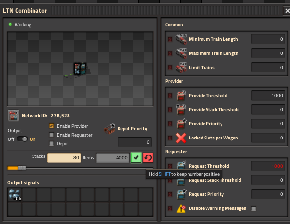
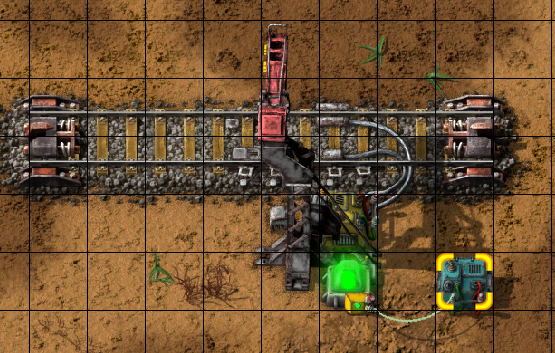
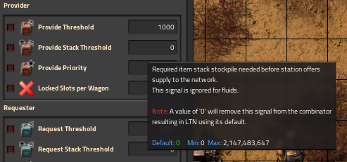
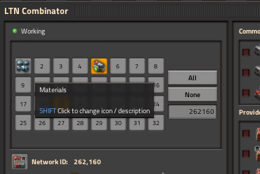

## Factorio 2.0 Status

This has been ported to Factorio 2.0 to support Logistic Train Network that has also now been ported to 2.0.

## LTN Combinator Modernized

A modernized, spiritual successor of [LTN Combinator](https://mods.factorio.com/mod/LTN_Combinator)
that provides friendly UI to manage
[Logistic Train Network](https://mods.factorio.com/mod/LogisticTrainNetwork) signals at
individual train stops. Translations are provided by
[LTN Language Pack](https://mods.factorio.com/mod/LTN_Language_Pack)

## Usage

The LTN Combinator is used in place of the standard constant combinator that would feed stop
specific signals to LTN.  An LTN specific GUI is presented to manipulate LTN's control signals and
make requests.  All of LTN's control signals are supported and tooltips show their description and
default values.  Please see
[LTN Manuals and Demos](https://forums.factorio.com/viewtopic.php?f=214&t=51072) for detailed functionality of LTN Control Signals

Connect the combinator to the input lamp of an LTN Train stop.

Tool tips show the LTN Signal description and default values.

## Features

- All LTN Signals can be reset to their default value by clicking the red reset button to the left
- All virtual signals can be set by the LTN combinator.  By default items and fluids will be
  adjusted to their negative value.  They can be left positive by holding `shift` or by mod setting.
- The provider or requester function of a stop can be "disabled".
  - Note: LTN does not have the ability to disable the request or provide functions of its train
    stops. This is accomplished by setting thresholds high enough that the stop does not request or
    advertise it can provide to the network.  The value of the high threshold can be adjusted in
    mod settings.
- Building new combinator via blueprint can be built turned off or with the request / provide
  functions disabled.  This behavior can be adjusted in mod settings.
- Creates an alert for the force when a new combinator is built by blueprint and functions have been
  disabled.  Behavior can be adjusted by mod setting.
- The number of slots for request (or other signals) can be adjusted in settings from 1 - 10 rows
  of 10 slots.  The default is 2 rows (20 slots).
- LTN Combinators are fast replaceable with Constant Combinators.
- LTN Network ID can be configured using the Network Configuration panel.
- Each of the 32 available networks can have an icon and text description associated with it.

Network ID Builder and Network ID tooltip

## Known Issues

- Using the blueprint "Select new contents ..." button on blueprints in the players Blueprint Library
  will result in broken blueprints.  This is a
  [Factorio bug](https://forums.factorio.com/viewtopic.php?f=182&t=88100).
- Rotating a blueprint and re-placing it over existing entities may result in the wrong
  configuration of the LTN Combinator.
